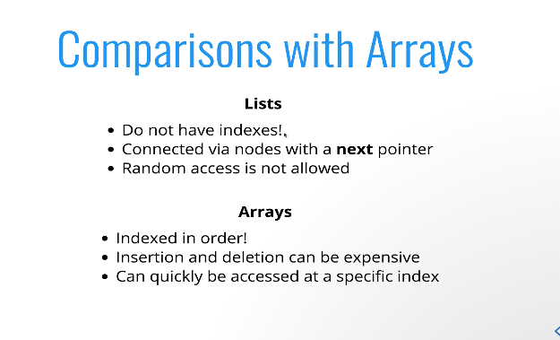

# Data Structures
Data structures are collections of values, the relationship between them, and the functions or operations that can be applied to the data

#### What characteristics must a data structures have and what are things in common between data structures? 

- collection of values
- contain a relationship between these values
- functionality/operations that can be applied to the array.

Different data structure excel in different situation. They are very useful in special cases and you have to know about them in order to decide when to implement one. 

You've already worked with many data structure unknowingly. DOM - tree. They are often an interview questions.

## These are some we'll be focussing on...
- Binary Search Trees
- Queues 
- Single Linked Lists 
- Undirected Unweighted Graphs 
- Binary Heaps 
- Directed Graphs
- Hash Tables
- Double Linked Lists
- Stacks

## Linked lists 

### Objectives: 

1. Define what a singly linked list is 
2. Compare and contrast Linked Lists with Arrays 
3. Implement insertion, removal and traversal methods on Singly Linked List

### Definition: 

A **linked list** is a data structure, in which the elements are **not** stored at contiguous(right next to each other) memory locations. The elements in a linked list are linked using **pointers** as shown in the image below:

Source: [Geeks for Geeks](https://www.geeksforgeeks.org/data-structures/linked-list/)

We could also say that linked list consists of **nodes**, and each **node** has a **value** and a **pointer** to another node or null.
Each item stores the address of the next item in the list. A bunch of random memory addresses are linked together. 

* The first and last node of a linked list usually are called the **head** and **tail** of the list, respectively. Thus, we can traverse the list starting at the head and ending at the tail. 
* The tail node is a special node, where the next pointer is always pointing or linking to a **null** reference, indicating the end of the list.

Arrays are great if you want to read random elements instantly, because you can look up any element of your array instantly.Arrays allow **random** access. With a linked list, the elements aren't next to each other, so you can't calculate the position of the fifth element. You have to go to the first element, to get the address to the second and so forth. This is so-called **sequential access** which means we could only read the elements one by one, starting at the first item.

|               | Array          | Linked list  |
| ------------- |:-------------:| ---------:|
| Reading       | O(1)          |   O(n)    |
| Insertion     | O(n)          |   O(1)     |
| Deletion      | O(n)          |   O(1)     |

*Insertion and Deletion refer to the beginning or the end of the array/linked lists.*

